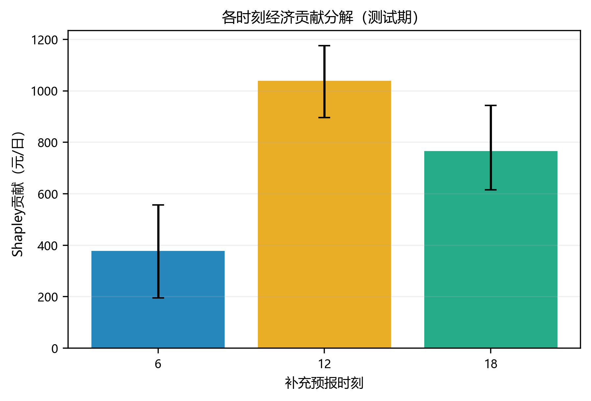
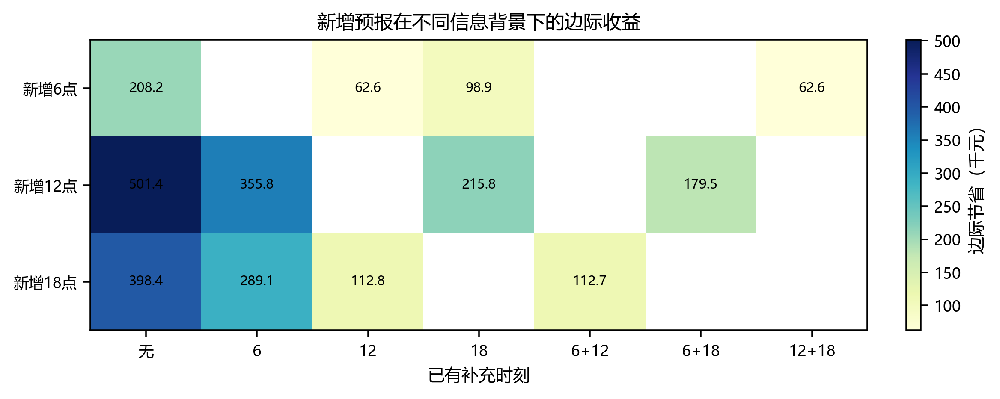
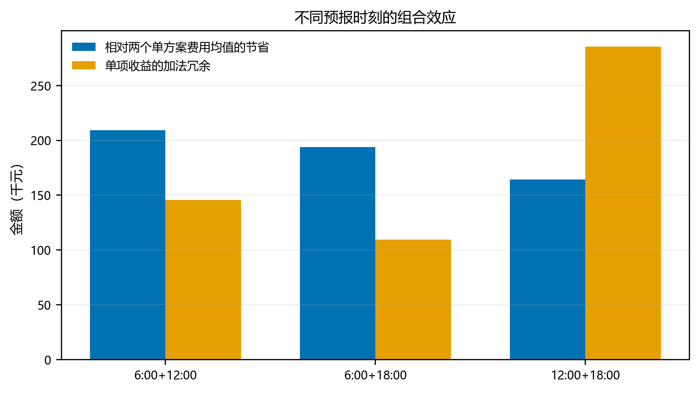
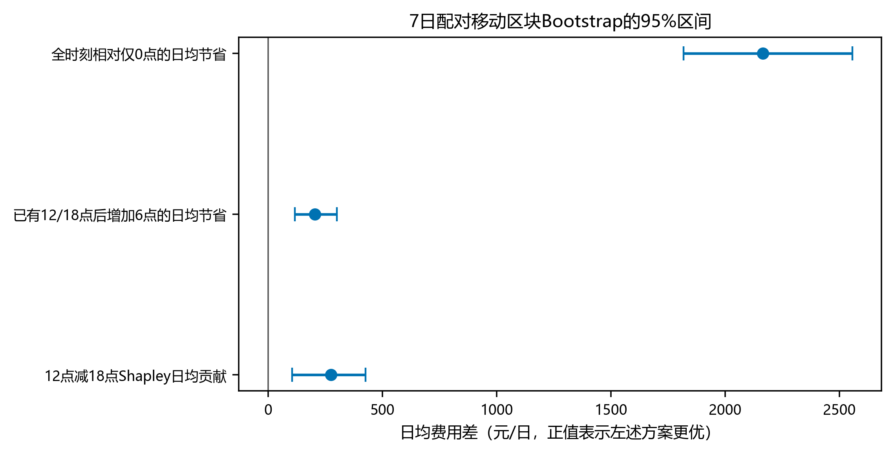
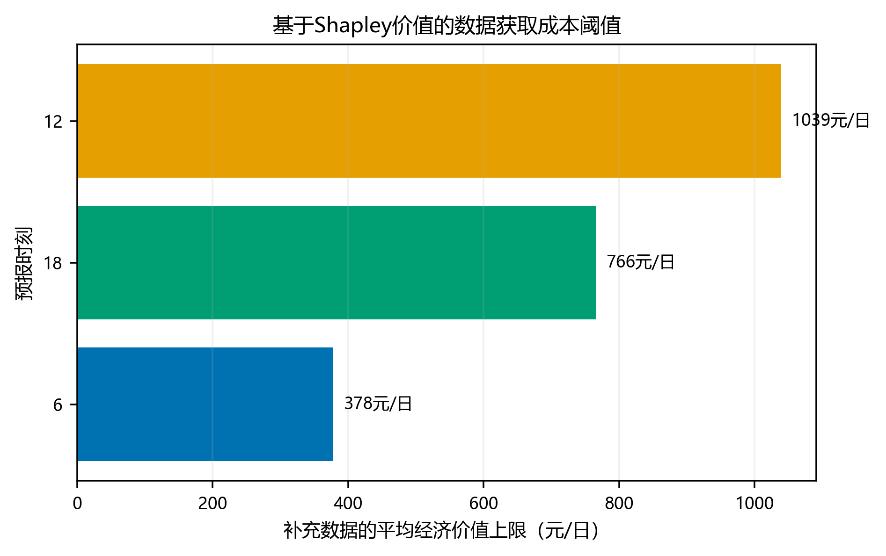

# 问题三补充预报价值研究

## 1. 研究口径

以6:00、12:00和18:00是否启用为三个二元因素，八种方案构成完整的 $2^3$ 组合。主结论采用2025-02-25起的冻结测试期（310个合同），全年334个合同仅作回溯稳健性对照。每日费用按合同起始日配对。
移动区块Bootstrap对已经连续运行得到的逐日费用差重采样，并未重新求解被抽中的SOC轨迹，因此它用于衡量时间区段上的经验稳定性，不等同于重新模拟新的年度路径。

## 2. Shapley经济贡献

全时刻方案在测试期相对仅0点方案共节省 **676,741.11元**。Shapley值将该总收益按每个时刻在6种加入顺序中的平均边际贡献进行唯一分摊：

|时刻|测试期贡献（元）|占比|全年贡献（元）|
|---|---:|---:|---:|
|6:00|117,176.39|17.31%|124,190.22|
|12:00|322,217.47|47.61%|342,663.23|
|18:00|237,347.25|35.07%|262,811.08|

12点贡献最大，18点次之，6点最小；三者贡献均为正。若只能补充一个时刻，现有证据优先支持12点。

## 3. 增加预报的边际效益

边际效益取决于已经启用了哪些时刻，不能只报告单独加入的结果。

|新增时刻|已有时刻|边际节省_元|
|---|---|---|
|6:00|无|208,187.48|
|6:00|12|62,617.86|
|6:00|18|98,898.80|
|6:00|12+18|62,583.36|
|12:00|无|501,389.06|
|12:00|6|355,819.44|
|12:00|18|215,779.38|
|12:00|6+18|179,463.94|
|18:00|无|398,378.37|
|18:00|6|289,089.69|
|18:00|12|112,768.69|
|18:00|6+12|112,734.19|

所有情境下新增时刻的边际节省均为正，但随着其他时刻已经启用，新增价值普遍下降，说明信息之间存在覆盖。

## 4. 组合效应

按题意同时报告两种口径：第一种比较两个单时刻方案费用的平均值与联合方案；第二种使用标准的加法收益分解。‘加法冗余’为正表示两条单项收益存在重叠，即替代关系，而不是负面作用。

|组合|单时刻费用均值_元|联合方案费用_元|联合相对单方案均值节省_元|加法冗余_元|解释|
|---|---|---|---|---|---|
|6:00+12:00|12,462,822.80|12,253,604.15|209,218.65|145,569.62|边际收益重叠（替代）|
|6:00+18:00|12,514,328.15|12,320,333.91|193,994.24|109,288.68|边际收益重叠（替代）|
|12:00+18:00|12,367,727.36|12,203,453.32|164,274.04|285,609.68|边际收益重叠（替代）|

三个二时刻联合方案均优于对应两个单时刻方案的费用均值；与此同时，加法冗余均为正，表明这些时刻总体属于部分替代而非超加性互补。其中12点与18点的收益重叠最大。

## 5. 配对移动区块Bootstrap

同一次重采样对八种方案使用完全相同的连续日期区块，保留同日可比性和一部分跨日相关。主结果使用7日区块以保留周周期，14日区块用于稳健性复核；每种长度重复5000次。

|区块长度_日|指标|均值|中位数|CI下限|CI上限|区间跨0|
|---|---|---|---|---|---|---|
|7|全时刻相对仅0点的日均节省|2,173.81|2,164.57|1,817.04|2,556.23|False|
|7|已有12/18点后增加6点的日均节省|205.66|205.15|116.36|300.87|False|
|7|6点Shapley日均贡献|375.12|375.47|195.48|556.82|False|
|7|12点Shapley日均贡献|1,035.73|1,034.92|895.56|1,175.21|False|
|7|18点Shapley日均贡献|762.95|757.29|615.21|942.75|False|
|7|12点减18点Shapley日均贡献|272.78|275.86|105.69|426.78|False|
|14|全时刻相对仅0点的日均节省|2,170.09|2,162.42|1,829.68|2,537.72|False|
|14|已有12/18点后增加6点的日均节省|209.99|209.43|127.96|295.98|False|
|14|6点Shapley日均贡献|371.02|370.03|199.97|543.95|False|
|14|12点Shapley日均贡献|1,035.72|1,034.71|907.74|1,167.17|False|
|14|18点Shapley日均贡献|763.34|757.96|605.72|950.78|False|
|14|12点减18点Shapley日均贡献|272.38|275.80|84.51|436.08|False|

若95%区间不跨0，可表述为该方向在不同连续时间区段的重采样中较稳定；本文不把它夸大为独立同分布假设下的传统显著性检验。

## 6. 对开放性问题的回答

在不计补充数据获取成本时，三个时刻全部启用的测试期总费用最低，且三个时刻Shapley贡献均为正，因此补充日内光伏预报具有经济价值。优先级为12点、18点、6点。
是否实际增设某个数据源还应比较其获取、通信和维护成本与相应边际收益。Shapley日均贡献可以作为长期平均成本阈值；若系统已有12点和18点接口，是否再增加6点则应使用“已有12/18点后增加6点”的条件边际收益，而不是6点的独立贡献。

## 7. 图表索引

其余数据分布、月度稳定性、逐日差异、联盟价值图均位于 `figures/`。PNG用于论文预览，SVG保留可编辑矢量文字，`*_gray.png`用于灰度可读性检查。
